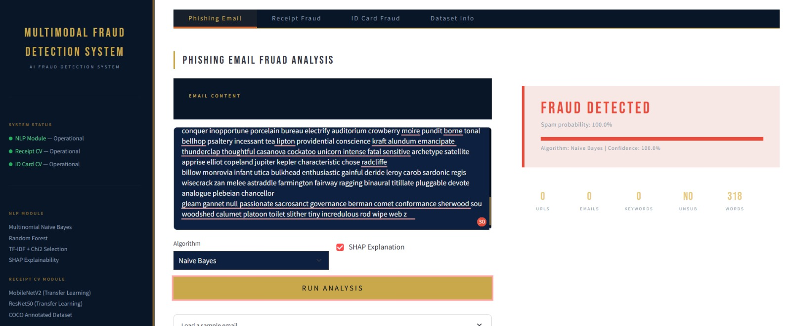
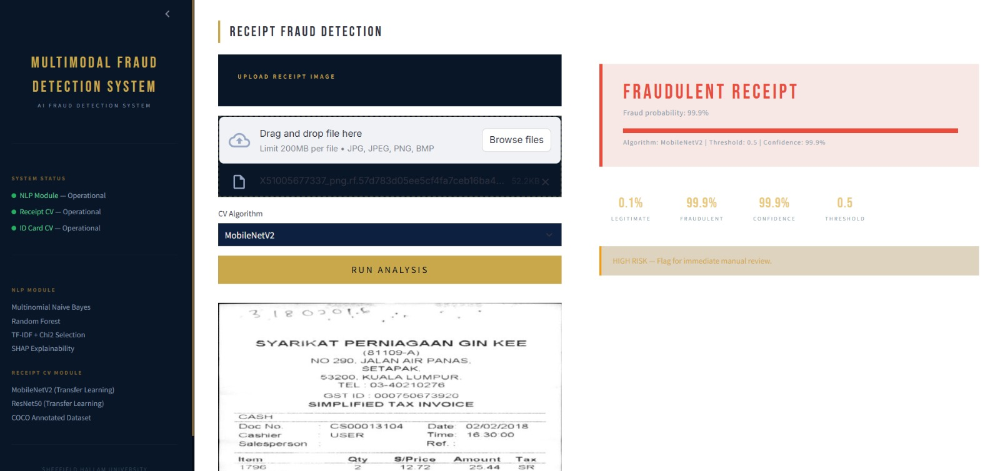
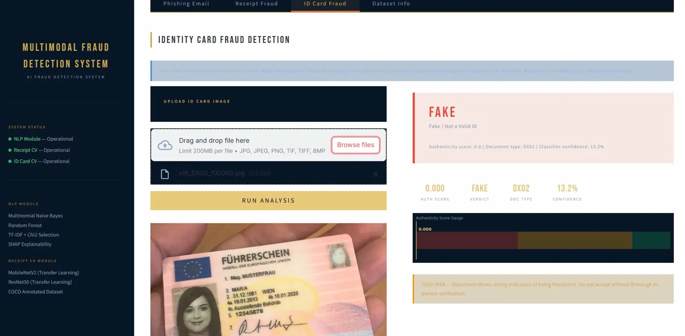

#  Multimodal Fraud Detection System AI

An AI-powered fraud detection system built with Streamlit that combines NLP and Computer Vision to detect phishing emails, fraudulent receipts, and fake identity documents.

> **Academic Research Project — MSc AI & Data Science 2024, Sheffield Hallam University**

---

##  Screenshots

### Phishing Email Analysis


### Receipt Fraud Detection


### ID Card Fraud Detection


---

  Detection Modules

| Module | Models | Dataset |
|--------|--------|---------|
| **Phishing Email (NLP)** | Multinomial Naive Bayes, Random Forest | Enron + Ling-Spam |
| **Receipt Fraud (CV)** | MobileNetV2, ResNet50 | SROIE via Roboflow (1,265 images) |
| **ID Card Fraud (CV)** | MobileNetV2 + ResNet50 + One-Class SVM | MIDV-2019 |

---

##  Project Structure

```
project/
│
├── App_Frontend.py                          # Main Streamlit application
│
├── backend/saved_models/                   # NLP & ID card models
│   ├── mnb_model.pkl
│   ├── rf_model.pkl
│   ├── tfidf_vectorizer.pkl
│   ├── chi2_selector.pkl
│   ├── ocsvm.pkl
│   ├── feature_scaler.pkl
│   ├── label_encoder.pkl
│   ├── model_config.json
│   ├── phishing_keywords.json
│   ├── stat_feature_cols.json
│   └── mobilenet_final.h5
│   └── resnet_final.h5
│
└── backend/receipts_models/                # Receipt CV models
    ├── mobilenet_receipt_fraud.keras
    ├── resnet50_receipt_fraud.keras
    ├── cv_config.json
    └── cv_metrics.json
```

---

##  Requirements

- Python 3.10
- TensorFlow 2.19
- Keras 3.x
- NumPy < 2.0

---

##  How to Run

### 1. Clone or download the project

```bash
git clone <your-repo-url>
cd <project-folder>
```

### 2. Create a virtual environment (recommended)

```bash
conda create -n fraud_app python=3.10
conda activate fraud_app
```

### 3. Install dependencies

```bash
pip install tensorflow==2.19 keras
pip install "numpy<2.0"
pip install pandas scikit-learn streamlit shap==0.43
pip install opencv-python pillow scipy matplotlib seaborn
pip install spacy
python -m spacy download en_core_web_sm
```

### 4. Ensure model files are in place

Make sure all model files exist at the paths shown in the **Project Structure** section above. The app will show a red status dot in the sidebar for any module whose models are missing.

### 5. Run the app

```bash
streamlit run App.py
```

Then open your browser at `http://localhost:8501`

---

##  Module Details

###  Phishing Email Analysis (Tab 1)
- Paste any email content into the text area
- Choose between **Naive Bayes** or **Random Forest**
- Optionally enable **SHAP Explanation** to see which words drove the prediction
- The pipeline: pre-cleaning → spaCy lemmatisation → TF-IDF → Chi-squared selection → classification

###  Receipt Fraud Detection (Tab 2)
- Upload a receipt image (JPG, JPEG, PNG, BMP)
- Choose between **MobileNetV2** or **ResNet50**
- The model outputs a fraud probability and verdict (Legitimate / Fraudulent)

###  ID Card Fraud Detection (Tab 3)
- Upload an ID card image (JPG, JPEG, PNG, TIF, TIFF, BMP)
- The pipeline extracts 128-dim features using both CNN models, then applies One-Class SVM anomaly detection
- Returns a three-tier verdict: **Genuine**, **Suspicious**, or **Fake**

###  Dataset Info (Tab 4)
- Overview of all three datasets, pipeline steps, and ethical considerations

---

##  Known Dependency Notes

- **NumPy**: Must be `< 2.0` — pandas and other packages conflict with NumPy 2.x
- **Keras**: Must be **Keras 3.x** — the `.keras` models were saved on Colab with Keras 3 and will fail to load on Keras 2.x
- **Streamlit**: Use a recent version; older versions do not support `use_container_width` in `st.image()`

---

##  Ethical Considerations

- Models may produce false positives for legitimate users
- Training data may underrepresent certain demographics or document types
- All high-risk verdicts should be reviewed by a qualified person before any consequential decision
- This system does not store submitted content
- Production deployment must comply with GDPR and applicable law
